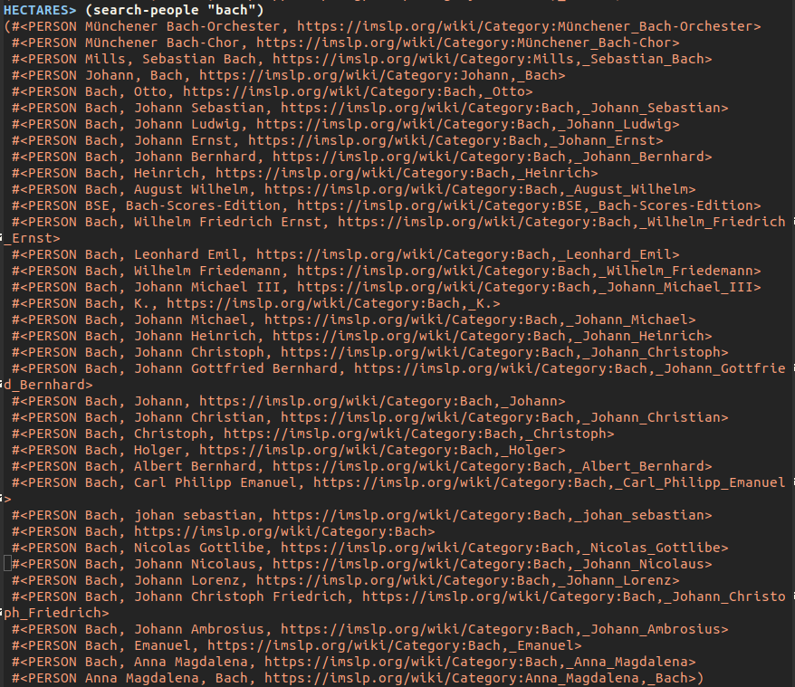
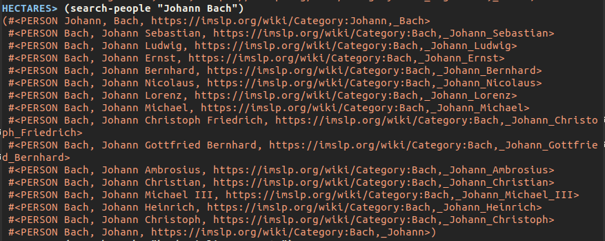

# hectares
## An IMSLP API library in Common Lisp

Hectares is a Common Lisp library for handling imslp gathering and search operations. The [IMSLP API](https://imslp.org/wiki/IMSLP:API) provides two json files, one for works and one for people, and this project is structured accordingly. 

Hectares uses bordeaux-threads to gain speed through multithreading; it is currently set to use 4 cores, go to config.lisp to change ```*cores*``` or likewise ```(setq *cores* number-of-cores)```

## Useful functions

### People
```(gather-people)``` will return a list of all people on IMSLP, stored as ```hectares::person``` objects. Works are likewise stored as ```hectares::work``` objects.

```(search-people name-string)``` will search through all people for a completely matching name, for instance:



or



The method ```(metadata object)``` uses web-scraping to gather more information than the imslp api provides, for a person it returns a metaperson object. Currently it only adds a person's dates, but other attributes will be added soon. (Also can fail with pages that have been deleted.)


### Works

```(search-works search-string)``` will search through all works for complete matches (currently, and regrettably, disregards plural instruments (violin vs violins):


```(gather-works)``` somewhat works but there are so many works that it runs at a snail-pace, it may be most useful to bail after an amount of time and reference ```*all-works*``` for what has been collected so far.


## Sometimes it all starts with a joke:

Q- *How much land is used to grow all the trees needed to make all the paper necessary to print all the copies of all the editions of the works of Berlioz?*

A- *A Hectare of Berlioz*
